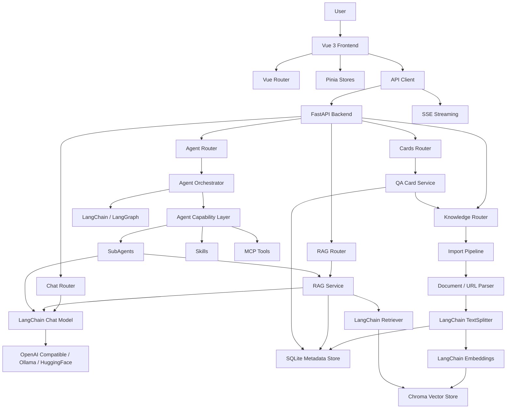
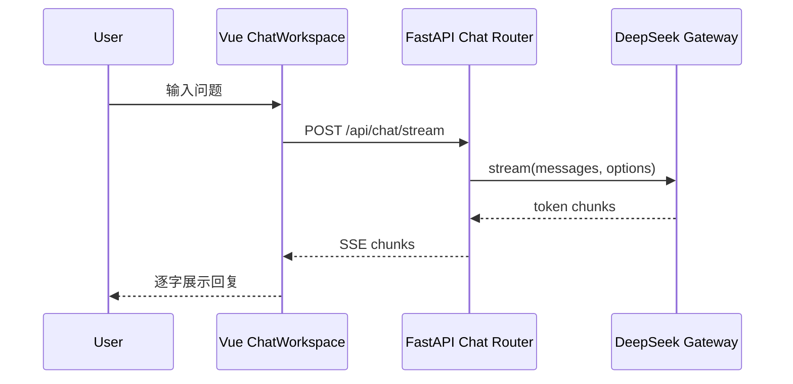
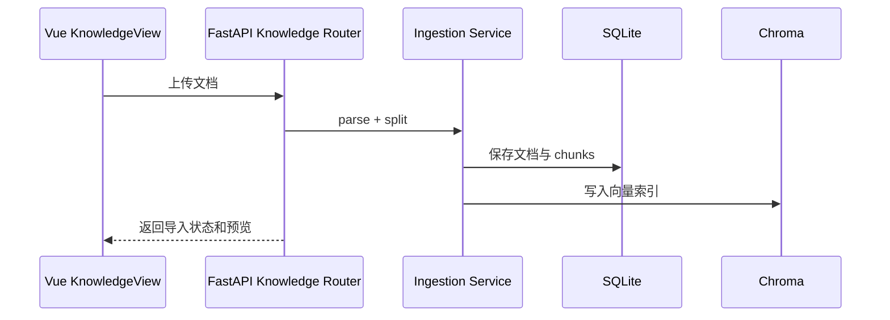
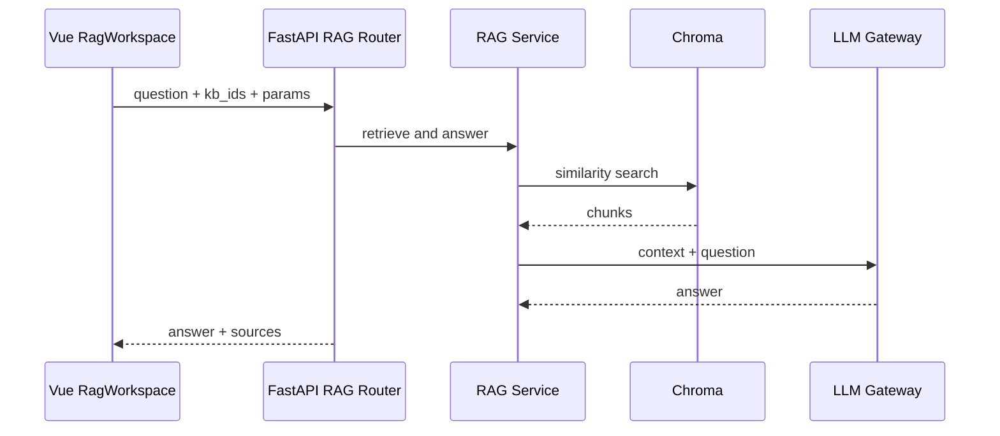
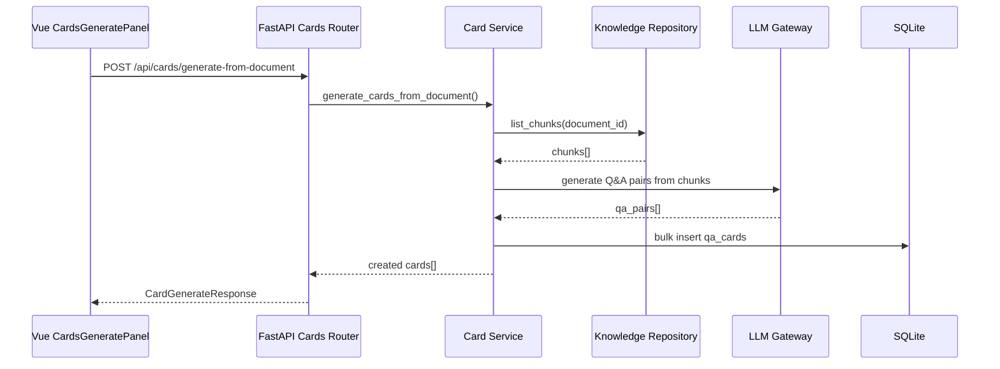
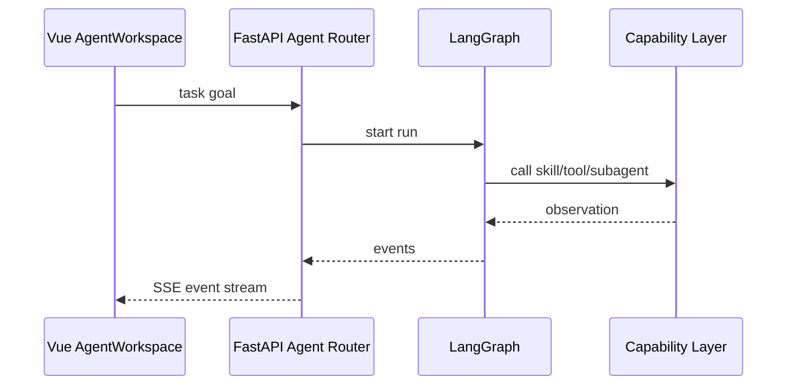

# DESIGN：全能学习助理系统架构

## 1. Architecture Goals

全能学习助理定位为“学习型 AI 知识工作台”。新架构采用 **Vue 前端 + FastAPI 后端** 的前后端分离方式，目标同时满足：

- 高保真还原 `prototype/index.html`。
- 支撑 Chat、RAG、Agent 三种严格区分的模式。
- 让 DeepSeek、RAG、LangChain / LangGraph、Agent Capability Layer 都沉在后端。
- 全面采用 LangChain 生态：LangChain TextSplitter、Chroma 向量库、LangChain Embeddings、LangChain Chat Model、LangGraph Agent 编排。
- 保障前端不接触 API Key。
- 形成可演示、可测试、可写进简历的完整工程。

三种模式必须严格区分：

- Chat 不调用 Skills/MCP/SubAgent，只提供联网搜索、思考深度、模型与会话设置。
- RAG 不调用通用 Skills/MCP/SubAgent，只围绕知识库、检索参数和来源片段。
- Agent 才开放学习角色 SubAgent、学习 Skills 和多步骤任务编排；MCP 作为后端扩展能力，不作为当前核心入口；取消 cowork、云端/本地工作场景。

## 2. High-level Architecture



## 3. Technology Stack

### 3.1 Frontend

- Vue 3
- Vite
- TypeScript
- Composition API + `<script setup lang="ts">`
- Tailwind CSS
- Vue Router
- Pinia
- @lucide/vue
- pnpm

Vue 约束：

- 根组件和路由视图只做组合，不塞完整业务。
- 组件使用 PascalCase。
- 复杂状态进入 Pinia 或 composables。
- 派生状态用 `computed`，副作用用 `watch`。
- 组件通信默认 props down / events up。
- 不使用 `v-html` 渲染不可信内容。

### 3.2 Backend

- Python 3.12
- FastAPI
- uv
- Pydantic schemas
- LangChain OpenAI（兼容任何 OpenAI 协议服务：DeepSeek / OpenAI / Qwen / Moonshot / Groq 等）
- langchain-ollama（Ollama 本地模型集成）
- langchain-community HuggingFaceEmbeddings（本地 sentence-transformers 嵌入）
- LangChain（TextSplitter、Embeddings、Chat Model、RetrievalQA）
- LangGraph（Agent 多步骤编排）
- Chroma（向量存储，LangChain 集成）
- SQLite（元数据存储）
- pytest

### 3.3 Communication

- REST：普通 CRUD、知识库管理、卡片管理、配置查询。
- SSE：Chat / RAG / Agent 的流式输出。
- JSON schema：前后端共享接口契约。
- 前端不读取模型 Key；后端从环境变量或 `.env` 读取。

## 4. Frontend Architecture

目标目录：

```text
frontend/src/
  app/
    App.vue
    router.ts
    main.ts
  assets/
  components/
    shell/
    chat/
    rag/
    agent/
    knowledge/
    cards/
    inspector/
  composables/
    useChatStream.ts
    useTheme.ts
    useModeBoundary.ts
  stores/
    modeStore.ts
    chatStore.ts
    knowledgeStore.ts
    ragStore.ts
    agentStore.ts
  styles/
    tokens.css
    main.css
  views/
    WorkbenchView.vue
    KnowledgeView.vue
    CardsView.vue
```

组件边界：

- `AppShell`：整体布局，承载侧边栏、顶部栏、主工作区、Inspector。
- `SidebarNav`：资源入口与知识库摘要。
- `ModeTabs`：Chat / RAG / Agent 顶部切换。
- `ModeTopBar`：根据当前模式渲染设置项。
- `ChatWorkspace`：Chat 输出流、输入区和会话状态。
- `RagWorkspace`：RAG 回答、来源片段和保存卡片入口。
- `AgentWorkspace`：计划、步骤、工具调用和最终汇总。
- `InspectorPanel`：按模式展示会话、检索或 Agent log。
- `KnowledgeView`：知识库列表、导入、切分预览。
- `CardsView`：卡片列表、翻牌、掌握程度。

## 5. Backend Architecture

目标目录：

```text
src/ai_study_agent/
  api/
    main.py
    deps.py
    routers/
      chat.py
      knowledge.py
      rag.py
      cards.py
      agents.py
    schemas/
      chat.py
      knowledge.py
      rag.py
      cards.py
      agents.py
  core/
  llm/
  knowledge/
  ingestion/
  rag/
  cards/
  agent_capabilities/
  agents/
  storage/
```

API 边界：

- `POST /api/chat/completions`：普通 Chat 非流式。
- `GET /api/chat/stream` 或 `POST /api/chat/stream`：SSE 流式 Chat。
- `GET /api/knowledge-bases`：知识库列表。
- `POST /api/knowledge-bases`：创建知识库。
- `POST /api/knowledge-bases/{id}/documents`：导入文档。
- `GET /api/knowledge-bases/{id}/chunks`：切分预览。
- `POST /api/rag/query`：RAG 问答。
- `POST /api/cards`：保存问答卡片。
- `POST /api/cards/libraries`：创建问答库。
- `GET /api/cards/libraries`：列出问答库。
- `POST /api/cards/generate-from-chunks`：从 chunks 批量生成问答卡片。
- `POST /api/cards/generate-from-document`：从文档批量生成问答卡片。
- `PATCH /api/cards/{id}/mastery`：更新卡片掌握程度。
- `POST /api/agents/run`：Agent 任务启动。
- `GET /api/settings`：获取当前模型配置。
- `PUT /api/settings/chat-model`：更新对话模型配置。
- `PUT /api/settings/embedding-model`：更新嵌入模型配置。
- `GET /api/settings/presets`：获取 OpenAI 兼容预设服务列表。
- `POST /api/settings/detect-models`：自动检测可用模型。
- `GET /api/agents/{run_id}/events`：Agent SSE 事件。

## 6. Data Flow

### 6.1 Chat Flow



### 6.2 Import Flow



### 6.3 RAG Flow



### 6.4 Card Generation Flow



知识库与问答库的打通关系：

- **正向生成**：从知识库文档/切片 → 自动生成问答卡片 → 保存到指定问答库
- **来源追溯**：每张卡片通过 `source_chunk_ids` 记录来源切片，通过 `knowledge_base_id` 记录来源知识库
- **RAG 混合检索**：RAG 问答时可同时参考知识库 chunks 和问答库卡片，形成 `local_vector_index+qa_library_hybrid` 检索模式

### 6.5 Agent Flow



## 7. Storage Model

- `knowledge_bases`
- `source_documents`
- `chunks`
- `conversations`
- `messages`
- `qa_libraries`
- `qa_cards`
- `agent_runs`
- `agent_steps`
- `tool_calls`

SQLite 保存元数据；Chroma 保存向量索引；文件原文存本地受控目录。

## 8. Configuration

后端环境变量：

- `DEEPSEEK_API_KEY`
- `DEEPSEEK_BASE_URL`
- `DEEPSEEK_MODEL`
- `EMBEDDING_PROVIDER`
- `EMBEDDING_MODEL`
- 运行时模型配置通过 Settings API 管理，支持 OpenAI 兼容 / Ollama / HuggingFace
- `CHROMA_PERSIST_DIR`
- `SQLITE_DB_PATH`
- `CORS_ALLOW_ORIGINS`

前端环境变量：

- `VITE_API_BASE_URL`

前端不得配置模型密钥。

## 9. Development Order Decision

路线重订后，推荐顺序：

1. **文档重基线**：明确 Vue + FastAPI 技术栈，清空旧 Streamlit 主线进度。
2. **前端高保真静态壳**：用 Vue 还原原型主界面，不接后端。
3. **FastAPI 后端骨架**：暴露 health、chat schema、CORS、配置检查。
4. **Chat 垂直闭环**：Vue 调 FastAPI，FastAPI 调 DeepSeek，SSE 输出。
5. **Knowledge 导入闭环**：Markdown/TXT 导入、切分、预览、SQLite 保存。
6. **RAG 闭环**：Embedding、Chroma、检索、回答、来源片段。
7. **Cards 闭环**：保存问答、翻牌、掌握程度。
8. **Agent 能力层**：Skills、MCP、SubAgent registry。
9. **Agent 编排**：LangGraph 状态图、角色选择、任务拆解和步骤跟踪。
10. **工程化交付**：截图、演示脚本、README、简历证据。
